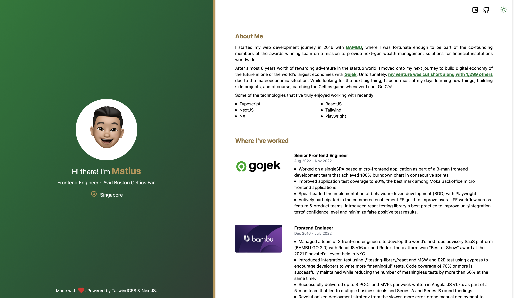

# matiushariman.com

[](https://www.matiushariman.com)
[](https://www.matiushariman.com)
[](https://www.matiushariman.com)
[](https://www.matiushariman.com)
[](https://www.matiushariman.com)

Second iteration of my personal website built with Next.js 14 and TailwindCSS. Features a custom theme system, responsive two-panel layout, and smooth scroll animations. Deployed on Vercel at [matiushariman.com](https://www.matiushariman.com).

[](https://www.matiushariman.com)

## Tech Stack

| Tool | Version |
|------|---------|
| Next.js | 14 |
| React | 18 |
| TypeScript | 5 |
| TailwindCSS | 3 |
| NX | 22 |
| pnpm | — |

## Getting Started

**Prerequisites:** Node.js, pnpm, NX CLI (`pnpm add -g nx`)

```bash
git clone https://github.com/matiushariman/matiushariman.com.git
cd matiushariman.com
pnpm install
```

## Commands

```bash
# Dev server
pnpm nx serve website

# Production build
pnpm nx build website

# Run all tests
pnpm nx test website

# Run a single test file
pnpm nx test website --testFile=apps/website/specs/index.spec.tsx

# Lint
pnpm nx lint website
```

## Project Structure

```
matiushariman.com/
├── apps/
│   └── website/          # Next.js 14 app
│       ├── components/   # UI components + inline SVG icons
│       ├── constants/    # External URLs
│       ├── pages/        # Next.js pages (_app, _document, index)
│       ├── Providers/    # ThemeProvider (custom dark mode context)
│       ├── public/       # Static assets (logos, images)
│       └── specs/        # Tests
├── assets/               # README assets (badges, screenshots)
└── nx.json
```

## Key Features

- **Theme system** — custom `ThemeContext` with theme toggle; no third-party library
- **Responsive layout** — fixed sidebar on desktop, stacked on mobile; `ThemeSwitch` rendered in both contexts via Tailwind breakpoint classes
- **Scroll animations** — Intersection Observer drives section fade-in on scroll
- **Inline SVG icons** — Tabler Icons paths implemented as typed React components; no icon library
- **Analytics** — Vercel Analytics + Google Tag Manager

## License

MIT
